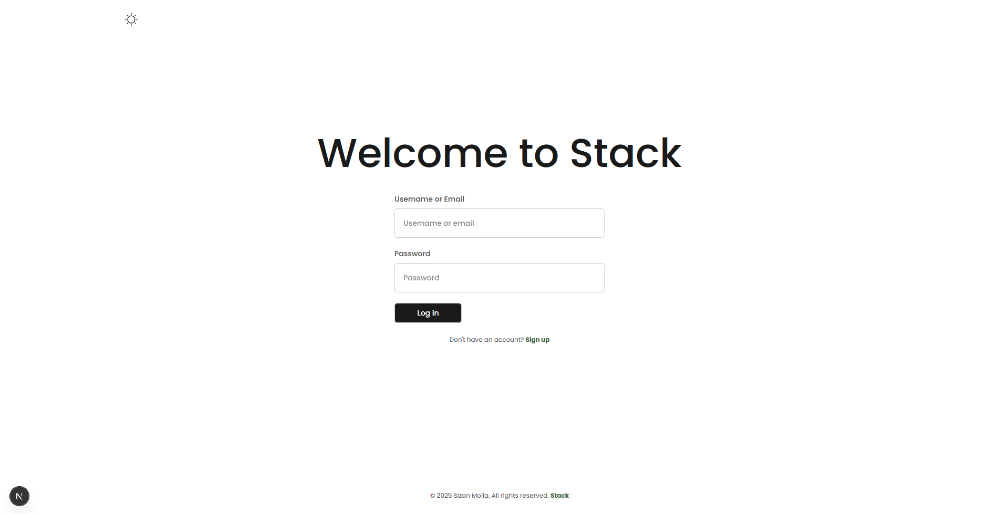
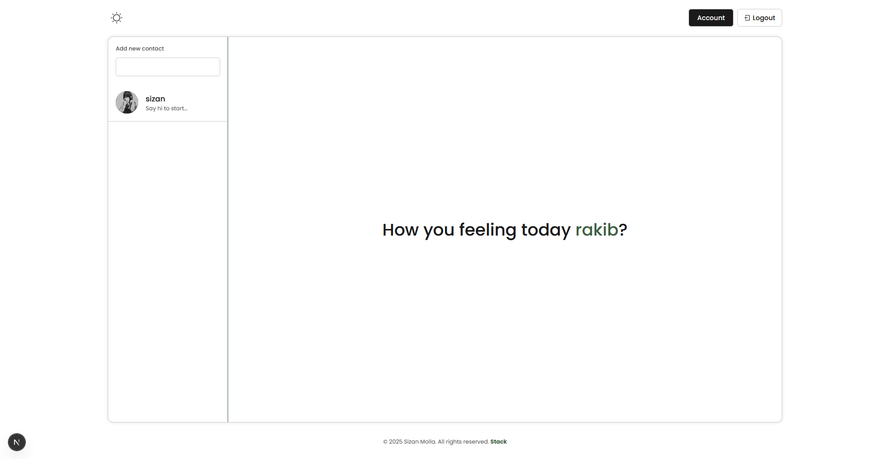
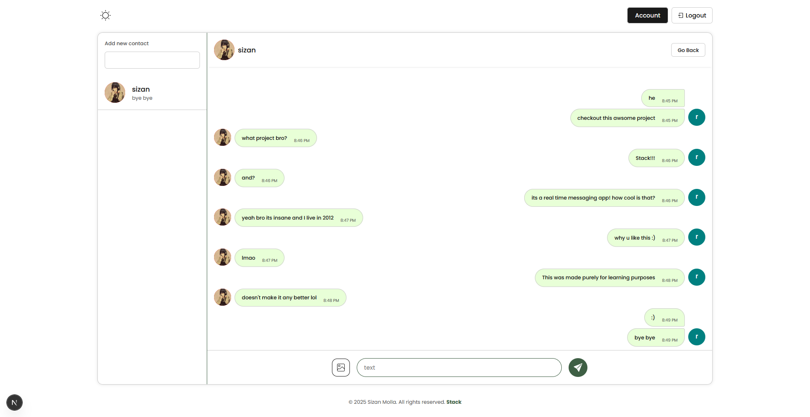
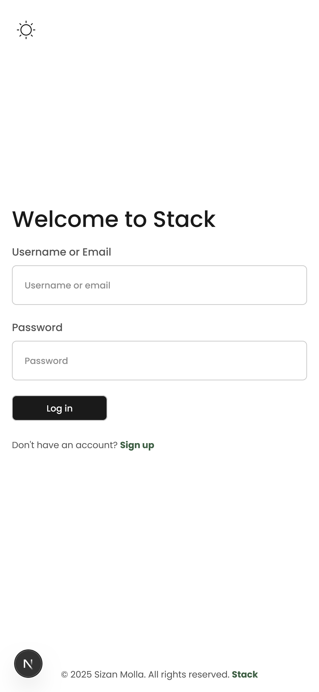
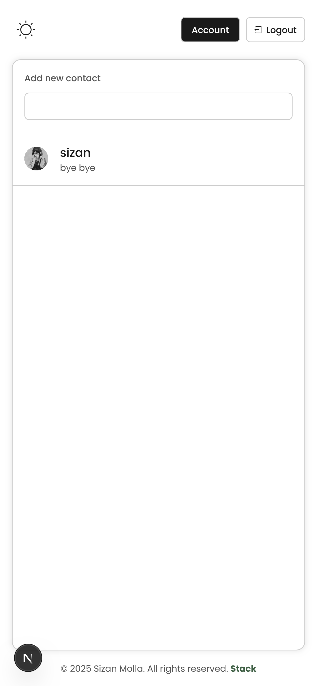
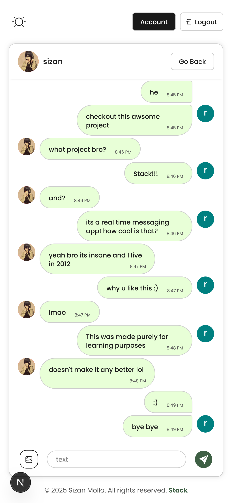

# 📌 Stack - Real-Time Chat App

A real-time chat application built with Next.js (frontend) and Express.js (backend), using Socket.IO for live messaging and MongoDB for persistence.

This repo contains both frontend and backend code in separate folders:

- frontend/ → Next.js app

- backend/ → Express.js server

---

## 🌐 Live Demo

[**Click here**](https://stack-sizan.vercel.app) or copy and paste https://stack-sizan.vercel.app/login

<br />

---

## Preview

### Desktop

<p align="center" >
  
  
  
</p>

### Mobile

<p align="center">
  
  
  
</p>

<br />

---

## 🚀 Features

- 🔥 Real-time messaging with Socket.IO

- 👤 User authentication (JWT )

- 💬 Private chats

- 📱 Responsive UI with TailwindCSS

- 🖼️ Image/file sharing (Upcoming)

<br />

---

## 🛠️ Tech Stack

**Frontend:** Next.js, React, TailwindCSS

**Backend:** Express.js, Node.js

**Database:** MongoDB

**Realtime:** Socket.IO

**Auth:** JWT

**Deployment:** Vercel + Render

<br />

---

## ⚙️ Installation & Setup (Frontend)

#### Clone the repo:

```
https://github.com/sizan14789/stack.git
```

#### Then set up the _*.env*_ file

Frontend

```ini
NEXT_PUBLIC_API_URL= http://localhost:3000
CLOUDINARY_CLOUD_NAME= your cloud name

# not putting cloud name is also fine if u don't plan to upload profile pics
```

Backend

```ini
PORT=3001
SERVER_URL="http://localhost:3001"
FRONTEND_URL="http://localhost:3000"

STAGE='dev'

JWT_SECRET= your secret

MONGO_URL=your database url

# use local database for dev purposes

```

#### Install modules

```
npm run install
```

#### Run on terminal 1

```
npm run dev:frontend
```

#### Run on terminal 2

```
npm run dev:server
```

Then open [http://localhost:3000](http://localhost:3000) with your browser to see the result.
